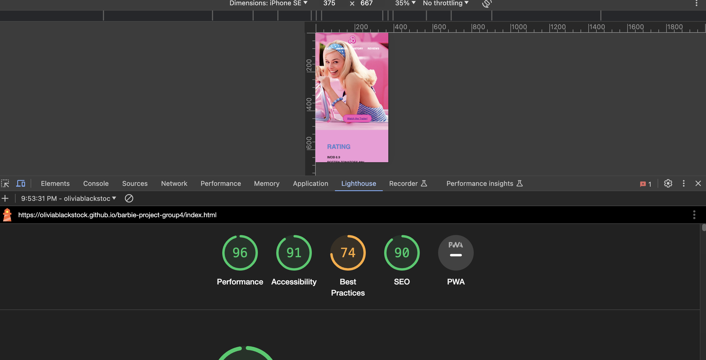
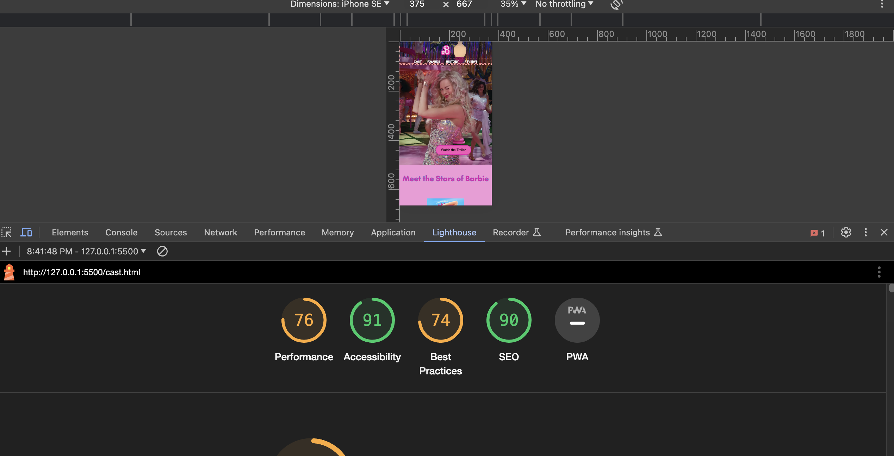

# barbie-project-group4
## Group 4 Website Link
[BarbieWebsite](https://oliviablackstock.github.io/barbie-project-group4/index.html)

## Lighthouse Report for Group Website 
All edits for accessibility, SEO, performance, and SEO were made to the best of our ability as a group. Any changes that we were capable of making were completed. 

## Wireframes and Style Guide 
[StyleGuide](https://drive.google.com/file/d/15Q1w6C1yOo2waXrKBmEfyQiU5iUgeLnY/view?usp=sharing)
[Wireframes](https://www.figma.com/file/FklmvL47CixKkHBWetMzcC/Untitled?type=design&node-id=0-1&mode=design&t=P6J9BUxWZlnqGgyC-0)

## Group Project Notes and Challenges 

Everyone was able to decide upon a movie relatively easily. We agreed to all take a page to complete the HTML on before we would begin CSS as we were all a little hesitant about the workflow of the CSS. 

Once we began building the site, things got a bit more difficult. We had some issues with communication about what group members were completing, when they could meet, and when they would be working on items. There was also some confusion regarding which pages everyone was working on despite following up in text messages. 

Overall, everyone worked hard on their pages to get the site done. Our biggest challenge was collaborating on the CSS as it just felt very overwhelming. There were several items that made styling the other pages more complicated and styling guidelines weren't being followed at first. We were able to course correct and fix that. 

### Commit Disparities 
Yajie created the wireframes and set up a good base for the CSS for everyone. She completed her page quickly and was available to assist everyone. She did a lot of work on this project and always communicated efficiently. 

Julia was also available and did her page, but ran into issues with VS Code Live Server. We tried to help her troubleshoot along with her attempts, but couldn't figure out what the issue was. Despite doing the work and trying to fix it, Kristin finished up the styling due to Julia being unable to see changes she was making. 

Michel was very communicative in the beginning and was involved. I beleive there was confusion during the project about what she was working on and what she had completed. She was less available as we got closer to the due date which caused confusion amongst other group members. She worked on other items that we wound up redoing as we did not know what she had done due to lack of communication. This was compounded by the work not following the agreed upon styling and wireframes. However, she did completed her page. 

Lastly, this was a challenging project that taught us all how difficult it can be to combine styles and ideas for websites. This was a good exercise for us to learn from. 

#### Page Assignments 
Homepage - Yajie 
Cast - Olivia 
Awards - Juila 
History - Michel 
Reviews - Kristin
